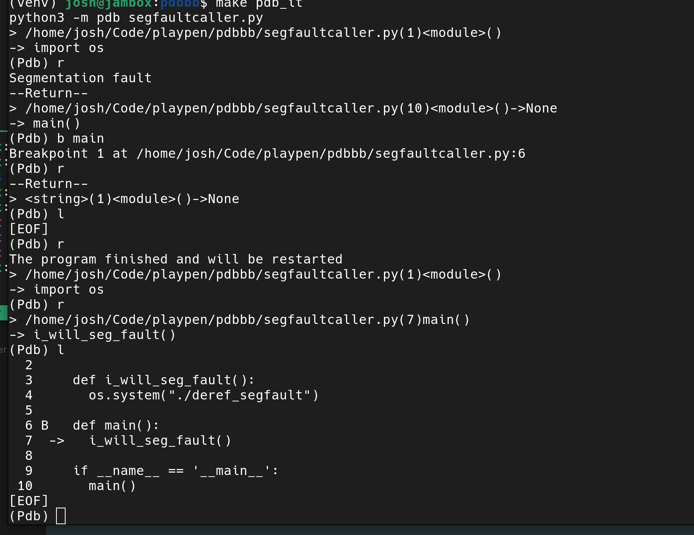
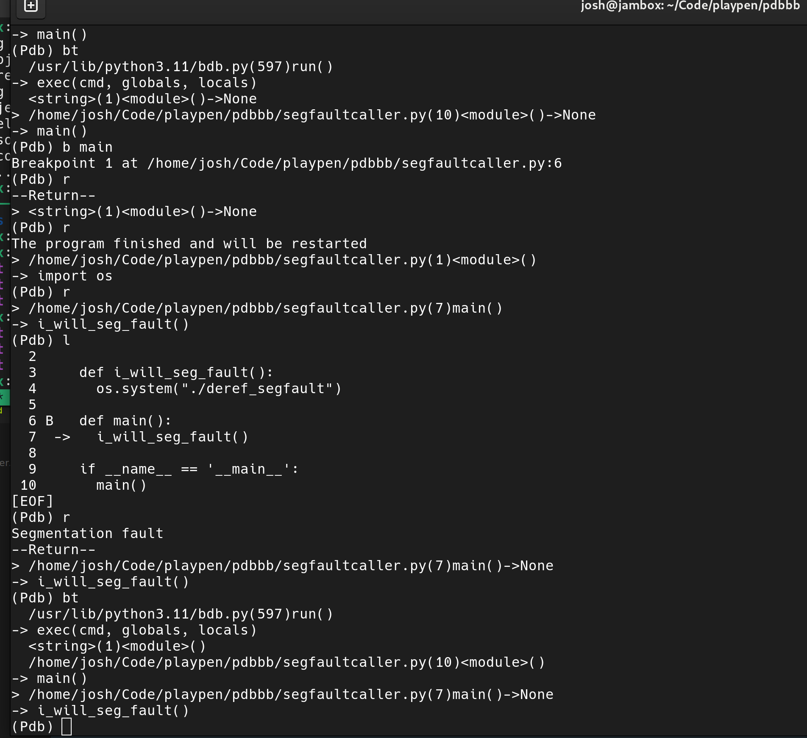

# Toy segfault PDB example
This repo serves to show how one may use `pdb` to hunt down the soruce of a segfault (or more specifically the line of python code that invokes a process that returns seg fault) in situ where neither `traceback` or `faulthandler` are enabled in the suspect script.

## Build segfaulting executbale
`make deref_segfault` will produce the binary that creates a segfault and is called by the segfautling python script

## Run pdb:
`make pdb_it` will launch you into a pdb shell

## What to do in pdb:
`bt` without debug symbols in the source script will point to the first function that is invoked in the stack. to get further granularity set a breakpoint with `b` at that new known failure point. You can `r` from that point on and set a breakpoint at the next nearest function to the segfault (see example2)

